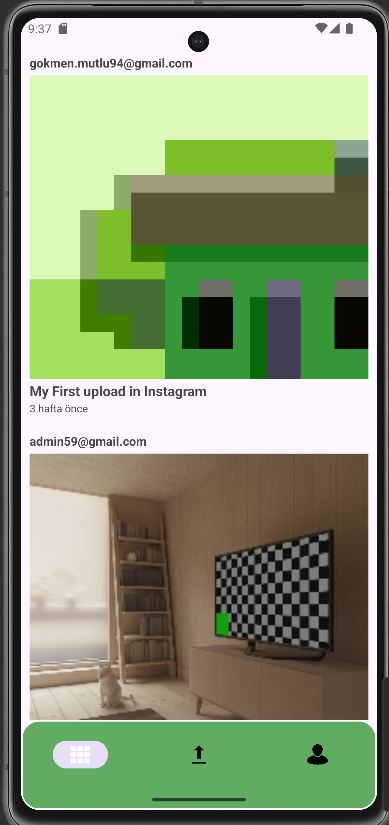
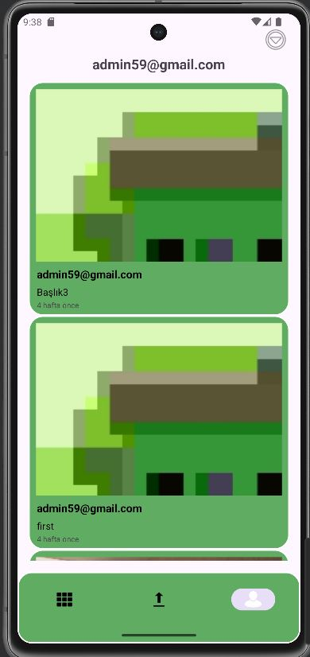
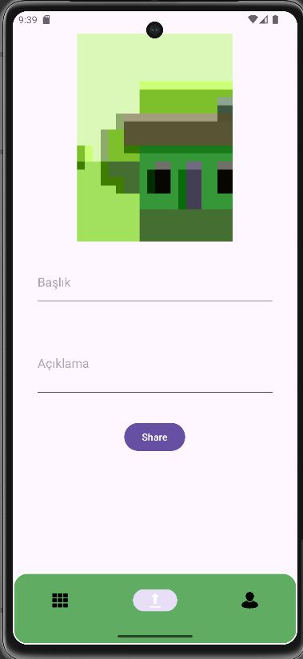
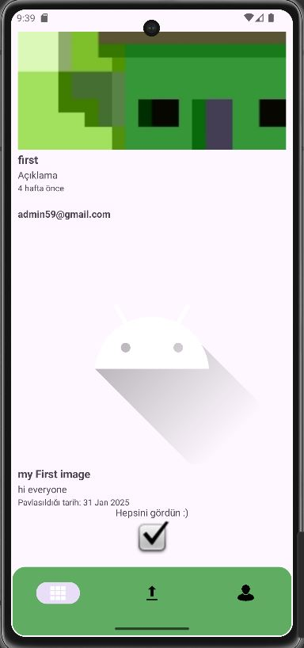

# Basic Insta Clone Firebase - Kotlin

Basic Insta Clone Kotlin, Firebase kullanılarak geliştirilen temel bir Instagram klonudur. Kullanıcıların Firebase Authentication ile giriş yapmasını, fotoğraf paylaşmasını ve verileri Firebase Firestore üzerinden saklamasını sağlar.

## Özellikler
- **Firebase Authentication**: Kullanıcılar e-posta ve şifre ile giriş yapabilir.
- **Fotoğraf Paylaşma**: Kullanıcılar uygulamaya fotoğraf yükleyebilir.
- **Veri Kaydetme ve Çekme**: Gönderiler Firebase Firestore veritabanına kaydedilir ve oradan çekilir.
- **Gerçek Zamanlı Veri Güncellenmesi**: Kullanıcılar paylaşılan gönderileri anlık olarak görebilir.
- **Basit ve Kullanıcı Dostu Arayüz**

## Ekran Görüntüleri
Aşağıda uygulamanın bazı ekran görüntüleri bulunmaktadır:

  
  
  
  

